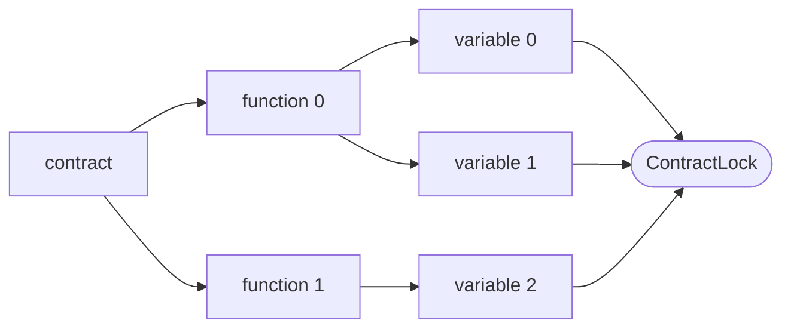
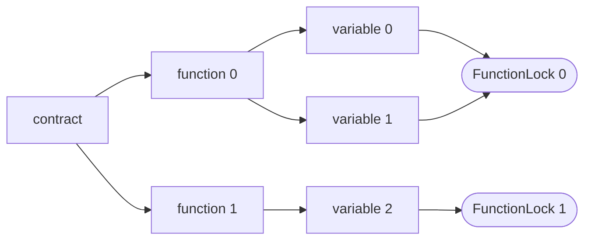
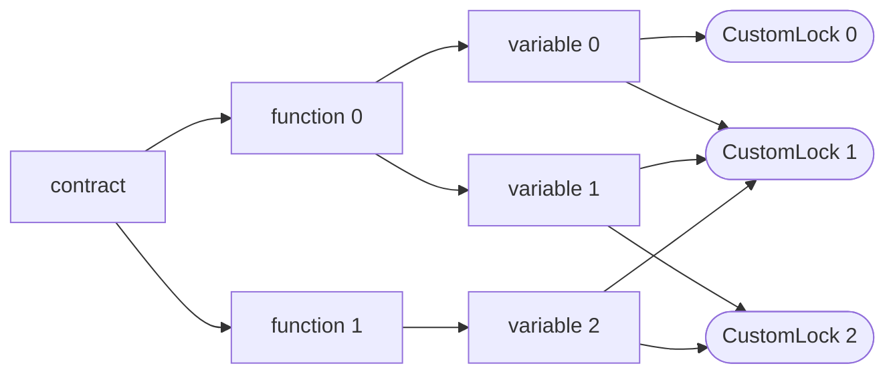

# Mutexer

Contract, function, and custom level mutexes for Solidity contracts.

> Note: at the time of writing, foundry supports neither solc 0.8.24 nor cancun hard fork, expect
> this to change and subsequently, this note, reasonably soon.

## Usage

Import, inherit, modifier:

```solidity
import { Mutexer } from "mutexer/Mutexer.sol";

contract Protocol is Mutexer {
    function dontReenterOnTheContract() external contractLock {
        // -- snip --
    }

    function dontReenterOnThisFunction() external functionLock(msg.sig) {
        // -- snip --
    }

    function dontReenterOnTheAboveFunction()
        external
        functionLock(this.dontReenterOnThisFunction.selector)
    {
        // -- snip --
    }

    function dontReenterOnThisKey() external customLock(0x45) {
        // -- snip --
    }
}
```

## API

### Contract Lock Modifier

```solidity
modifier contractLock()
```



The contract lock places a lock in transient storage at [`CONTRACT_LOCK`](#contract-lock-slot),
disallowing any execution context to reenter into the same contract.

### Function Lock Modifier

```solidity
modifier functionLock(bytes4 selector)
```



The function lock places a lock in transient storage at the `keccak256` digest of a `selector` and
[`FUNCTION_LOCK_SEED`](#function-lock-seed), disallowing any execution context to reenter into the
same `selector`.

### Custom Lock Modifier

```solidity
modifier customLock(uint256 key)
```



The custom lock places a lock in transient storage at the `key` slot, disallowing any execution
context to reenter into any code path with the same `key`.

> Warning: The `key` is NOT hashed, if the key collides with any other transient variables,
> including [`CONTRACT_LOCK`](#contract-lock-slot) and the digest of a selector and
> [`FUNCTION_LOCK_SEED`](#function-lock-seed), it will overwrite it.

### Contract Lock Slot

```solidity
uint256 constant CONTRACT_LOCK = uint256(keccak256("Mutexer.CONTRACT_LOCK")) - 1;
```

The contract lock slot is computed as the `keccak256` digest of `Mutexer.CONTRACT_LOCK` minus one.
The minus one makes the `CONTRACT_LOCK` a value with an unknown `keccak256` preimage, that is to say
there exists no known plaintext that, when hashed with `keccak256`, produces the `CONTRACT_LOCK`
value.

### Function Lock Seed

```solidity
uint256 constant FUNCTION_LOCK_SEED = uint256(keccak256("Mutexer.FUNCTION_LOCK_SEED")) - 1;
```

The function lock slot is computed as the `keccak256` digest of `Mutexer.FUNCTION_LOCK_SEED` minus
one. The minus one makes the `FUNCTION_LOCK_SEED` a value with an unknown `keccak256` preimage, that
is to say there exists no known plaintext that, when hashed with `keccak256`, produces the
`FUNCTION_LOCK_SEED` value.

For any given function `selector`, the selector is padded to 32 bytes, concatenated with the seed,
then hashed with `keccak256`.
